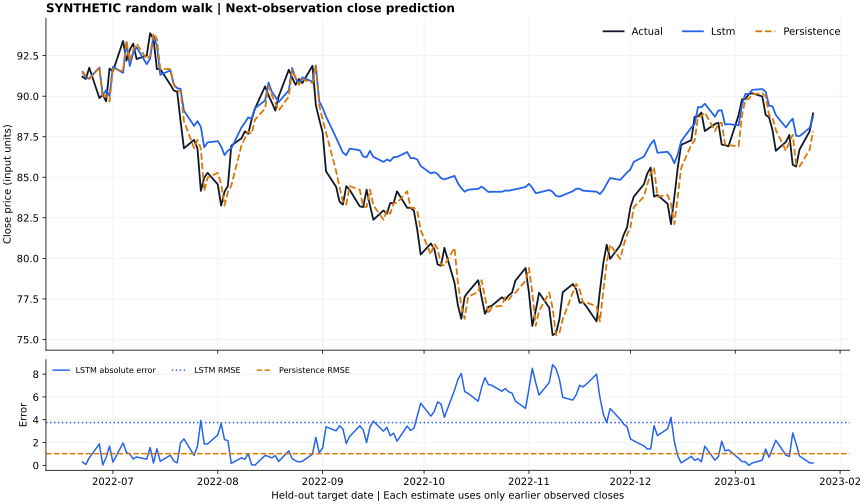
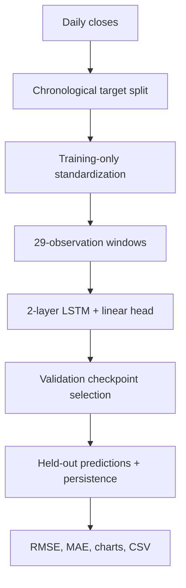

# Stock Price Prediction with PyTorch

**A reproducible LSTM forecasting lab with an interactive dashboard and an honest baseline.**

Train a two-layer recurrent network on historical closing prices, predict the next
observed session, and compare its errors against the last known close. Explore the
results in a notebook, a Streamlit dashboard, or exported charts and CSV files.

**Stack:** Python · PyTorch · pandas · NumPy · Matplotlib · Streamlit · yfinance

Inspired by NeuralNine's [Stock Price Prediction in Python with PyTorch](https://www.youtube.com/watch?v=IJ50ew8wi-0).
This implementation adds training-only normalization, validation-based early stopping,
persistence benchmarks, saved checkpoints, a CLI, a dashboard, and automated tests.



## Quick start

Python 3.11 or 3.12 is recommended. The included synthetic demo runs on CPU and does
not require market data, an API key, or a GPU.

```bash
git clone https://github.com/bhaarathsingh/stock-price-prediction-pytorch.git
cd stock-price-prediction-pytorch
python -m venv .venv
source .venv/bin/activate
# Windows PowerShell: .venv\Scripts\Activate.ps1

# Install the CPU build first to avoid unnecessary CUDA downloads on Linux/Windows.
python -m pip install -c constraints-tested.txt torch --index-url https://download.pytorch.org/whl/cpu
python -m pip install -c constraints-tested.txt -e ".[dev,dashboard,market]"

stock-lstm demo --out runs/demo
streamlit run app.py
```

On macOS, install PyTorch with `python -m pip install -c constraints-tested.txt torch` instead of the CPU-index
command. The CLI prints both model and baseline RMSE. The dashboard initially shows
the recorded synthetic run; **Run experiment** trains with the selected settings.
Choose a new output directory for each CLI experiment to preserve previous results.
`constraints-tested.txt` records the tested direct package versions; it is not a full
transitive dependency lock.

## What to inspect

| Engineering choice | Why it matters |
| --- | --- |
| Chronological train/validation/test targets | Evaluation uses later dates than fitting |
| Scaler fitted only through the last training target | Future price levels cannot alter training normalization |
| 29 historical closes → one next-close estimate | Matches the tutorial's 30-point window, with its target excluded |
| Validation-only checkpoint selection | Test errors do not select training epochs |
| Persistence baseline on exactly the same dates | A close-looking chart alone is weak evidence of useful prediction |
| Parameter, split-date, version, and data-hash records | Experiments can be traced and rerun |
| Leakage and checkpoint round-trip tests | Checks consequential failure modes in the pipeline |

## Recorded demo

The figure above uses **800 synthetic observations**, generated as a seeded geometric
random walk. These are not AAPL prices or evidence of market performance.

<!-- DEMO_RESULTS -->
| Model | Test RMSE | Test MAE |
| --- | ---: | ---: |
| LSTM | 3.7547 | 2.8549 |
| Persistence | 1.0234 | 0.8224 |

The LSTM performed worse than persistence on this run. There were 155 held-out
targets; validation selected epoch 113, and training stopped after 133 epochs.
Errors use synthetic price units. These are measured results, not market-return claims.
<!-- END_DEMO_RESULTS -->

The complete predictions, training history, and learning curve are in
[reports/demo](reports/demo). The model is not guaranteed to beat persistence.

## Use historical stock data

Download once, then train against the saved CSV so the input is explicit:

```bash
stock-lstm download --ticker AAPL --start 2020-01-01 --end 2025-01-01 --out data/AAPL.csv
stock-lstm train --csv data/AAPL.csv --label "AAPL adjusted close" --out runs/aapl
stock-lstm predict --checkpoint runs/aapl/model.pt --csv data/AAPL.csv
```

The download uses Yahoo Finance through `yfinance`, with `auto_adjust=True`; the end
date is exclusive. Network access and provider availability are required. A failure
returns an error; it never substitutes synthetic prices for a stock ticker.

You can also bring a daily CSV from your preferred provider:

```csv
Date,Close
2024-01-02,100.00
2024-01-03,101.25
```

The schema example is too short for training; provide at least several hundred rows.
Rows are sorted by date. Duplicate dates, missing values, nonnumeric prices, and
nonpositive prices are rejected. Extra columns are ignored. Use one ticker, one
currency, and one consistent price-adjustment convention per experiment.

## Notebook

```bash
python -m pip install -e ".[notebook]"
python -m ipykernel install --user --name stock-lstm --display-name "Stock LSTM"
jupyter lab notebooks/stock_prediction.ipynb
```

Choose the **Stock LSTM** kernel. The notebook walks through data, chronological
splits, the model, training, evaluation, and plots using the same tested package.
It uses a 50-epoch cap for exploration; the recorded CLI demo uses the 200-epoch default.

## Model and evaluation



Defaults: hidden size 32, two LSTM layers, Adam with learning rate 0.001, MSE loss,
batch size 64, gradient clipping at 1.0, up to 200 epochs, and patience 20.
Target windows are split 70% / 10% / 20%, with integer rounding. Hidden states start
at zero for each window. Only the training split updates weights.

Evaluation is **one step ahead using observed history**: at each held-out target,
earlier observed test prices may appear in the input window. Model weights and the
scaler remain fixed. The chart is not a recursive forecast of the entire test period.
The next-observation command reuses the selected checkpoint; it does not retrain on
all available history or infer exchange holidays.

Metrics are RMSE and MAE in the input price units. Direction accuracy compares the
sign of predicted and actual changes from the previous close; a flat prediction
only counts as correct when the actual change is also zero.

## Outputs and project layout

| Path | Contents |
| --- | --- |
| `src/stock_lstm/data.py` | Validation, download, standardization, chronological windows |
| `src/stock_lstm/model.py` | PyTorch LSTM and linear output layer |
| `src/stock_lstm/experiment.py` | Training, early stopping, baseline evaluation |
| `src/stock_lstm/reporting.py` | Plots, reports, checkpoint inference |
| `app.py` | Interactive local dashboard |
| `notebooks/stock_prediction.ipynb` | Step-by-step exploration |
| `tests/` | Data leakage, metric, model, CLI, and dashboard checks |
| `docs/methodology.md` | Tutorial relationship, design choices, and limitations |

Each run writes `metrics.json`, `predictions.csv`, `history.csv`, `forecast.svg`,
`loss.svg`, and `model.pt`. Downloaded data and model checkpoints are excluded from
git. The checkpoint stores tensor weights plus simple metadata and loads with
`weights_only=True`; only load checkpoints you trust.

## Development

```bash
python -m pytest -q
python -m ruff check .
python -m ruff format --check .
```

GitHub Actions runs the tests on Python 3.11 and 3.12. Tests use generated data and
controlled provider responses, so they do not depend on Yahoo being reachable.
See [the validation record](docs/validation.md) for measured results and environment limits.

## Limits

This is a programming and evaluation project, not a trading system. A single
historical holdout does not establish future accuracy. Adjusted historical prices
can be revised for corporate actions, so downloaded snapshots are not point-in-time
market databases. There is no trading simulation, transaction-cost model, execution
integration, or claim of profitable returns. CPU reproducibility is tested within
the recorded environment; results may differ across package versions and hardware.

## References

- [NeuralNine tutorial](https://www.youtube.com/watch?v=IJ50ew8wi-0) — conceptual starting point.
- [PyTorch LSTM](https://docs.pytorch.org/docs/stable/generated/torch.nn.LSTM.html)
- [PyTorch reproducibility](https://docs.pytorch.org/docs/stable/notes/randomness.html)
- [yfinance download API](https://ranaroussi.github.io/yfinance/reference/api/yfinance.download.html)

Implemented with AI coding assistance. See [methodology](docs/methodology.md) for
the additions and differences from the tutorial.
